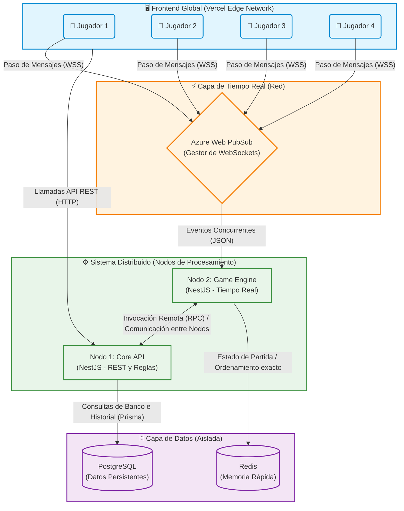

# Arquitectura Distribuida del Sistema QuizSync (Microservicios)

A continuación se presenta el diagrama de arquitectura en la nube para el sistema de trivia, evidenciando el modelo de Microservicios (2 servidores independientes) y la separación de responsabilidades que garantiza la concurrencia, transparencia y escalabilidad del sistema.

## Relación con Metas de Diseño (Sistemas Distribuidos)

1. **Modelo Cliente-Servidor:** Clara división entre la interfaz (Vercel) y los recursos (Nodos NestJS).
2. **Paso de Mensajes (Externo):** Representado por las flechas de `WSS` desde los clientes, ocultando la complejidad del sistema distribuido (Transparencia).
3. **Paso de Mensajes e Invocación Remota (Interna):** El `Game Engine` no tiene acceso a la base de datos de preguntas. Para iniciar una partida o guardar los resultados, debe enviar mensajes por red al `Core API` comunicando dos nodos distintos.
4. **Manejo de Concurrencia:** `Azure Web PubSub` recibe todas las conexiones simultáneas y las delega al `Game Engine`.
5. **Ordenamiento y Latencia:** El `Game Engine` utiliza `Redis` para resolver los empates en memoria RAM (< 5ms) sin afectar a la base de datos central de PostgreSQL, resolviendo el problema de ausencia de reloj global.
6. **Tolerancia a Fallos:** Si el nodo `Core API` sufre una caída, las partidas activas en el `Game Engine` (que dependen de Redis) continuarán funcionando sin interrupciones.
